# Sebastian Castillego & Rafael Moreno
## Escuela Colombiana de Ingeniería
### Arquitecturas de Software – ARSW


#### Ejercicio – programación concurrente, condiciones de carrera y sincronización de hilos. EJERCICIO INDIVIDUAL O EN PAREJAS.

##### Parte I – Antes de terminar la clase.

Control de hilos con wait/notify. Productor/consumidor.

1. Revise el funcionamiento del programa y ejecútelo. Mientras esto ocurren, ejecute jVisualVM y revise el consumo de CPU del proceso correspondiente. A qué se debe este consumo?, cual es la clase responsable?

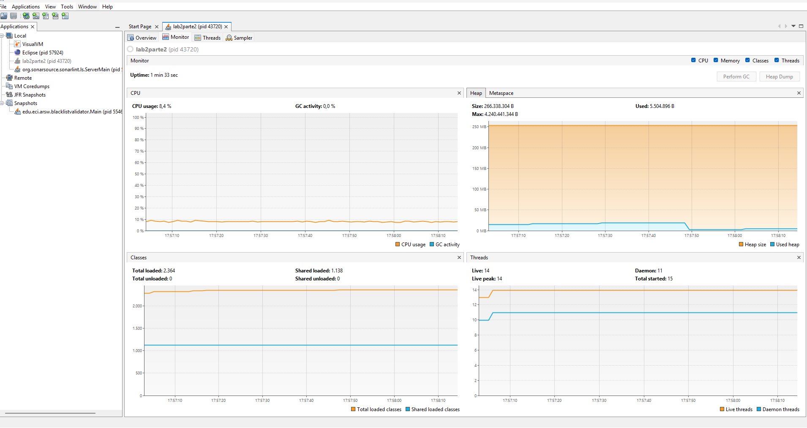

la clase responsable es Consumer.java. en su run() el cual tiene un ciclo infinito que se la pasa preguntando por la cola
con queue.size() y el .poll(), y aunque la cola este vacia igual sigue  sin parar y sin bloquearse nunca, investigando 
eso es una espera activa o busy waiting y por eso el hilo sigue unsando el nucleo completo.
en la imagen se ve el consumo fijo en 8,4% todo el tiempo sin picos, que es justo un nucleo al 100% repartido
entre todos los nucleos de la maquina

Producer.java tambien tiene un ciclo infinito, como tiene el Thread.sleep(1000) el hilo
se duerme y libera la cpu en cada vuelta, por lo cual no consume casi nada.

hay que tener en cuenta que un ciclo infinito por si solo no gasta como tal la cpu, lo que la gasta es no bloquearse nunca dentro del ciclo

2. Haga los ajustes necesarios para que la solución use más eficientemente la CPU, teniendo en cuenta que -por ahora- la producción es lenta y el consumo es rápido. Verifique con JVisualVM que el consumo de CPU se reduzca

para quitar la espera activa se uso wait y notify

en Consumer.java si la cola esta vacia el hilo llama a queue.wait(), o sea se duerme y suelta el lock,
en vez de quedarse esperando por el size(). el wait va dentro de un while y no de un if, ya que un hilo
puede despertar sin que nadie lo haya notificado, asi al despertar hay que volver a
mirar que la cola de verdad tenga algo

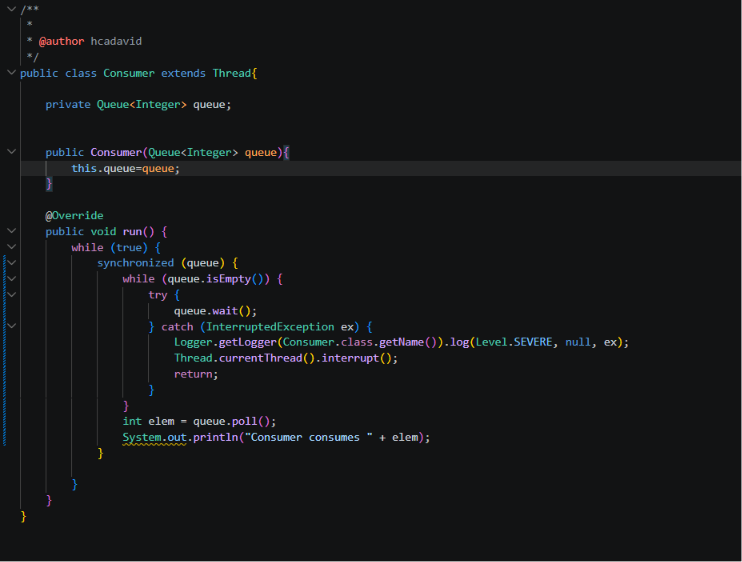

en Producer.java se agrego queue.notify() justo despues del queue.add(), dentro de un synchronized sobre la
misma cola. ese notify es el que despierta al consumidor cuando ya hay algo para consumir. el Thread.sleep(1000)
se dejo porque en este punto la produccion es lenta, y quedo por fuera del synchronized para no dormirse con
el lock en la mano y bloquear al otro hilo sin necesidad

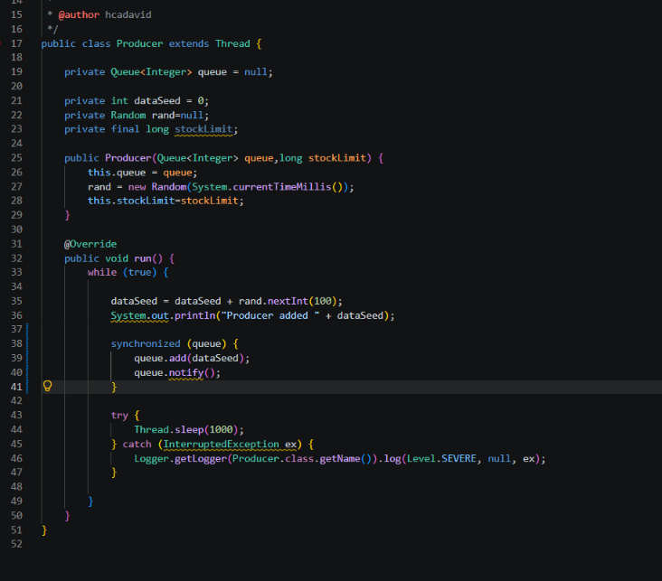

con eso el consumo de cpu bajo de 8,4% a 0,7% y la grafica se queda pegada en el piso. el consumidor ya no
gasta cpu mientras espera: solo se activa cuando de verdad hay un elemento

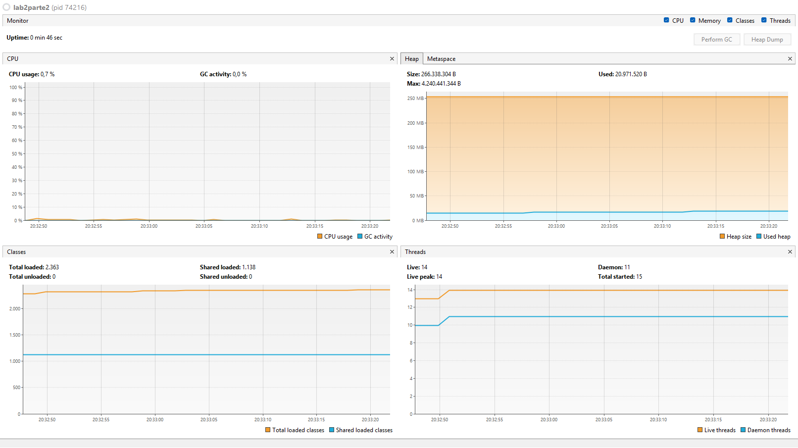

3. Haga que ahora el productor produzca muy rápido, y el consumidor consuma lento. Teniendo en cuenta que el productor conoce un límite de Stock (cuantos elementos debería tener, a lo sumo en la cola), haga que dicho límite se respete. Revise el API de la colección usada como cola para ver cómo garantizar que dicho límite no se supere. Verifique que, al poner un límite pequeño para el 'stock', no haya consumo alto de CPU ni errores.

el Thread.sleep(1000) se le quito al productor y se lo pase al consumidor.
ademas en StartProduction se le paso un stockLimit de 5 en vez de Long.MAX_VALUE, que era como no tener limite
en Producer.java el limite se respeta con un while que llama a queue.wait(). 

el consumidor se duerme cuando la cola esta llena. es importante que sea wait() y no un ciclo vacio preguntando por el size(), ya que  un ciclo vacio si
respeta el limite pero llegaria a quemar la cpu, que es justo el problema del primer punto 

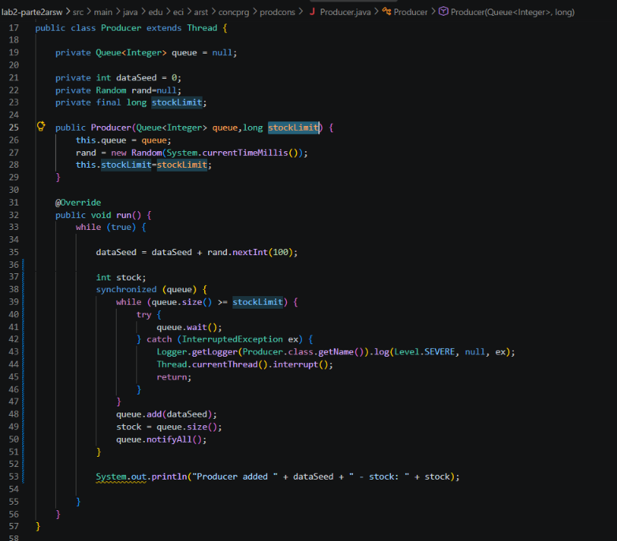

en Consumer.java se agrego queue.notifyAll() despues del poll(), para avisarle al productor que ya se libero un
puesto. se uso notifyAll() y no notify() porque ahora sobre la misma cola hay dos condiciones distintas, y con notify() 
se podria despertar al hilo equivocado y dejar el programa trabado

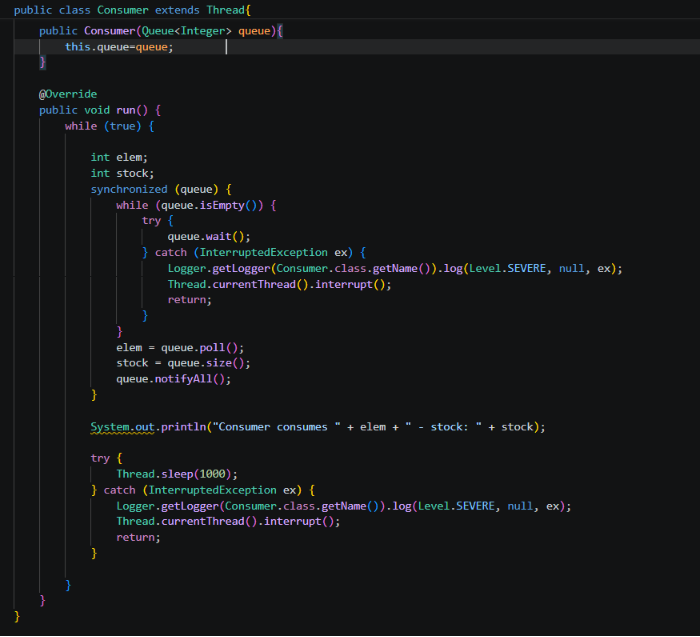

el consumo de cpu quedo en 0,1% aun con el productor corriendo sin ningun sleep, o sea a toda velocidad. eso pasa
porque el productor llena la cola hasta 5 y de ahi en adelante se la pasa dormido esperando a que el consumidor
saque algo, asi que termina yendo al ritmo del consumidor. tampoco salen errores: como el limite lo hace cumplir
el wait(), el queue.add() nunca se encuentra la cola llena

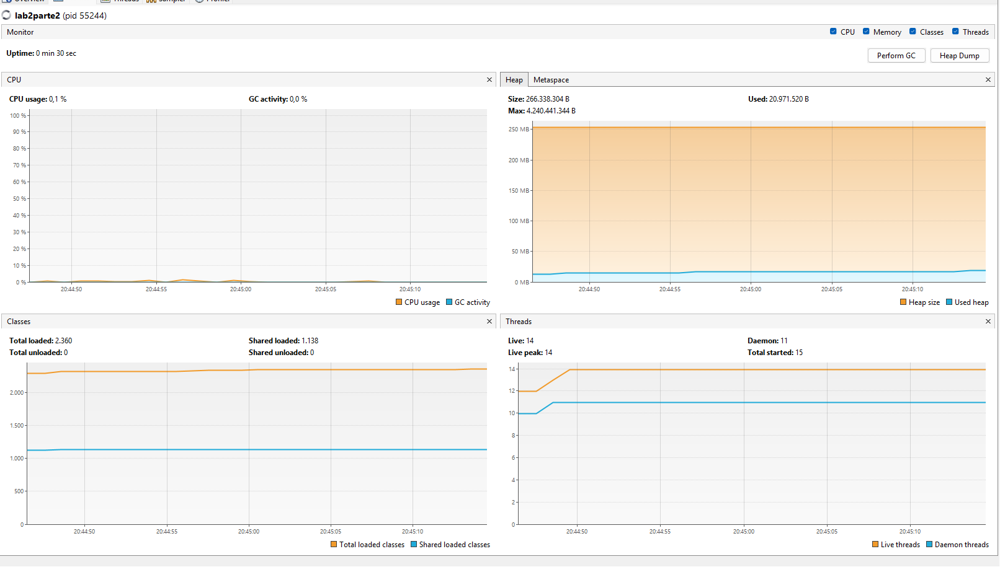

en la salida por consola se ve que el stock nunca pasa de 5:

```
Producer added 4 - stock: 1
Producer added 44 - stock: 2
Producer added 47 - stock: 3
Producer added 140 - stock: 4
Producer added 173 - stock: 5
Consumer consumes 4 - stock: 4
Producer added 201 - stock: 5
Consumer consumes 44 - stock: 4
Producer added 210 - stock: 5
Consumer consumes 47 - stock: 4
```

en los primeros 5 segundos, antes de que arranque el consumidor, solo se imprimen 5 lineas. un productor sin
freno habria imprimido millones, asi que esas 5 lineas son la prueba de que el hilo quedo dormido en wait() y
no girando


##### Parte II. – Antes de terminar la clase.

Teniendo en cuenta los conceptos vistos de condición de carrera y sincronización, haga una nueva versión -más eficiente- del ejercicio anterior (el buscador de listas negras). En la versión actual, cada hilo se encarga de revisar el host en la totalidad del subconjunto de servidores que le corresponde, de manera que en conjunto se están explorando la totalidad de servidores. Teniendo esto en cuenta, haga que:

- La búsqueda distribuida se detenga (deje de buscar en las listas negras restantes) y retorne la respuesta apenas, en su conjunto, los hilos hayan detectado el número de ocurrencias requerido que determina si un host es confiable o no (_BLACK_LIST_ALARM_COUNT_).
- Lo anterior, garantizando que no se den condiciones de carrera.

para que la busqueda se detenga apenas los hilos junten las 5 ocurrencias se uso un AtomicInteger compartido
entre todos los hilos.

en la corrida se ve que se revisaron 57.971 listas de 80.000, o sea la busqueda si se detuvo antes de recorrer
todo. en el host igual quedo reportado como NOT trustworthy y se encontraron las mismas 5 lista, 
asi que parar temprano no cambio el resultado. ese numero cambia en cada
ejecucion porque depende de cual hilo llegue primero a la quinta ocurrencia, pero nunca llega a 80.000

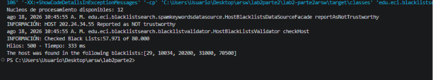

en HostSearchThread cada hilo recibe por constructor la misma referencia del contador (ocurrenciasTotales) y el
tope (alarmCount). el for gano una segunda condicion: sigue mientras le queden listas Y mientras entre todos no
se hayan encontrado 5 ocurrencias. cuando encuentra una la guarda en su lista local y ademas hace
incrementAndGet() sobre el contador compartido. asi cada hilo se detiene solo, porque un hilo no se puede
detener desde afuera: lo unico que se puede hacer es que el mismo revise una condicion y salga de su ciclo

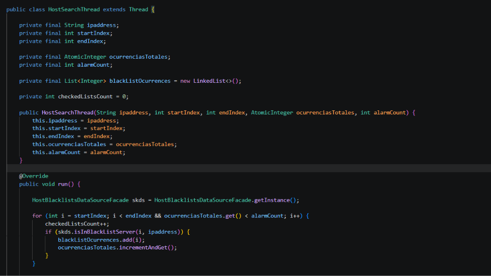

en HostBlackListsValidator el AtomicInteger se crea una sola vez y se le pasa a los 500 hilos, o sea todos
apuntan al mismo objeto. si cada hilo tuviera el suyo nunca sabrian el total. el reparto de segmentos y los
join() quedaron igual, y el reporte de confiable / no confiable quedo despues del ciclo para que se haga una
sola vez

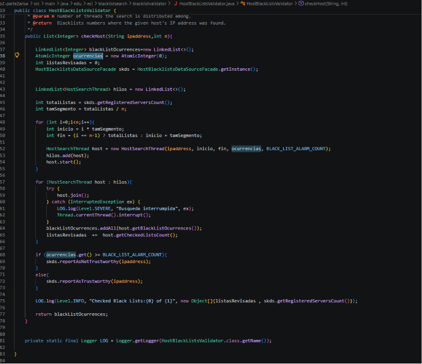

se uso AtomicInteger y no un int normal porque contador++ no es atomico: son tres pasos (leer, sumar, escribir)
y dos hilos pueden leer el mismo valor y perder un incremento, que es justo la condicion de carrera que pide
evitar el enunciado. si se perdieran ocurrencias el contador podria no llegar nunca a 5 y el host terminaria
reportado como confiable siendo peligroso. incrementAndGet() hace los tres pasos como una sola operacion
indivisible


##### Parte III. – Avance para el martes, antes de clase.

Sincronización y Dead-Locks.


1. Revise el programa “highlander-simulator”, dispuesto en el paquete edu.eci.arsw.highlandersim. Este es un juego en el que:

	* Se tienen N jugadores inmortales.
	* Cada jugador conoce a los N-1 jugador restantes.
	* Cada jugador, permanentemente, ataca a algún otro inmortal. El que primero ataca le resta M puntos de vida a su contrincante, y aumenta en esta misma cantidad sus propios puntos de vida.
	* El juego podría nunca tener un único ganador. Lo más probable es que al final sólo queden dos, peleando indefinidamente quitando y sumando puntos de vida.

2. Revise el código e identifique cómo se implemento la funcionalidad antes indicada. Dada la intención del juego, un invariante debería ser que la sumatoria de los puntos de vida de todos los jugadores siempre sea el mismo(claro está, en un instante de tiempo en el que no esté en proceso una operación de incremento/reducción de tiempo). Para este caso, para N jugadores, cual debería ser este valor?.

para este caso, en primera instancia vemos que el valor para cada unno de manera individual es de 100, pero en este caso como es la sumatoria de los N jugadores seria de N x 100

3. Ejecute la aplicación y verifique cómo funcionan las opción ‘pause and check’. Se cumple el invariante?.

no, el invariante no se cumple. con N inmortales la suma deberia quedarse en N x 100, pero sale mayor y sigue
creciendo cada vez que se oprime el boton, por ejemplo con 8 inmortales, que deberian sumar 800 a los 3 segundos ya sumaban 7390. 

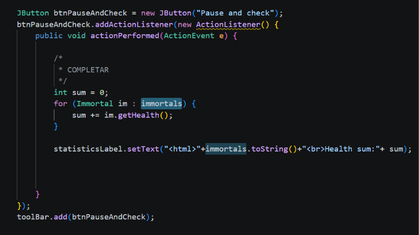


4. Una primera hipótesis para que se presente la condición de carrera para dicha función (pause and check), es que el programa consulta la lista cuyos valores va a imprimir, a la vez que otros hilos modifican sus valores. Para corregir esto, haga lo que sea necesario para que efectivamente, antes de imprimir los resultados actuales, se pausen todos los demás hilos. Adicionalmente, implemente la opción ‘resume’.

primero llamamos a Immortal.pauseAll(), que enciende una bandera que es
compartida, el boton resume llama a Immortal.resumeAll(), que la apaga y despierta a los hilos dormidos.
los dos son metodos static ya que la bandera es una sola para toda la clase, no una por inmortal y por eso se
llaman con el nombre de la clase y no sobre un objeto.

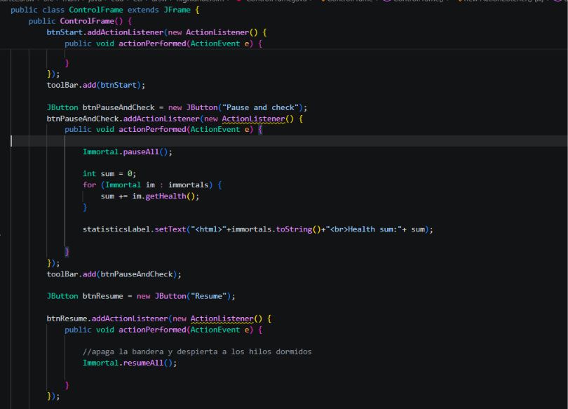

en Immortal el hilo principal no duerme a nadie. pauseAll() solo pone paused en true y retorna. cada inmortal
revisa esa bandera al inicio de cada vuelta de su run(), o sea entre pelea y pelea, y si esta encendida se
duerme el mismo con pauseLock.wait(). 

pauseLock es un new Object() vacio que existe solo para servir de candado. no se pudo usar la bandera porque un
boolean es primitivo y no tiene monitor, ni this porque cada inmortal tendria el suyo y serian 8 candados
distintos que no se excluyen entre si. es static para que sea uno solo y final para que la referencia no cambie.

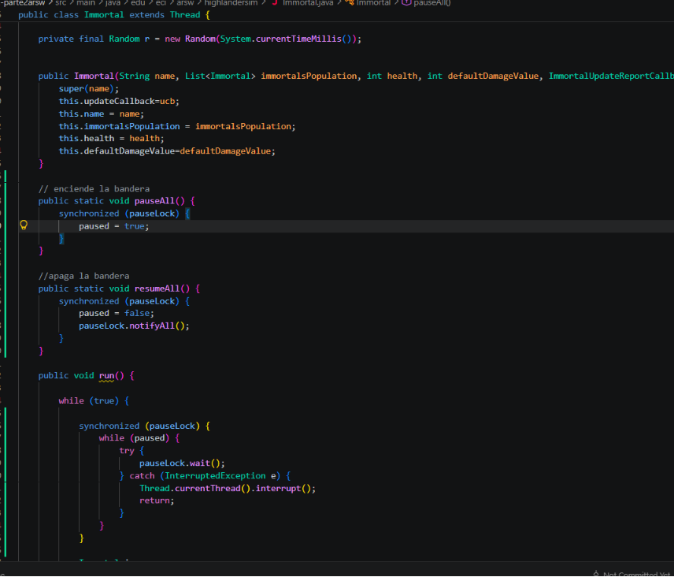


5. Verifique nuevamente el funcionamiento (haga clic muchas veces en el botón). Se cumple o no el invariante?.

no, el invariante sigue sin cumplirse. con 3 inmortales la suma deberia dar 300 y en la medicion nos dio 1040
y cada vez que oprimimos resume se vuelve a pausar el numero sale mas grande 

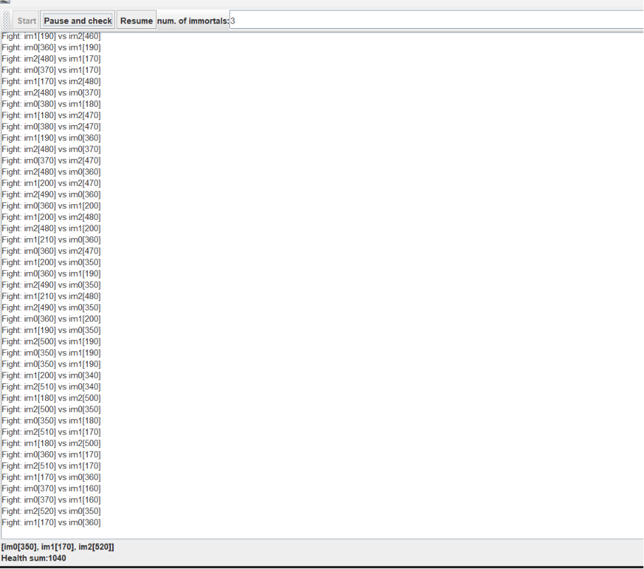

aunque ahora la pausa si funciona y el resumen tambien 

6. Identifique posibles regiones críticas en lo que respecta a la pelea de los inmortales. Implemente una estrategia de bloqueo que evite las condiciones de carrera. Recuerde que si usted requiere usar dos o más ‘locks’ simultáneamente, puede usar bloques sincronizados anidados:

	```java
	synchronized(locka){
		synchronized(lockb){
			…
		}
	}
	```

	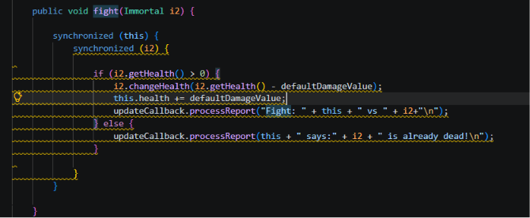

	la region critica es en fight(), porque se modifica la salud de dos inmortales a la vez. usando synchronized anidados sobre this y i2, el if quedo adentro para que la lectura y la escritura de la salud no se puedan intercalar.

	no se uso un lock comun porque eso haria que se volviera secuencial para todas las peleas

	con esto el invariante ya se cumple exacto y por ejemplo con 8 inmortales la suma se queda en 800 en todas las
	mediciones

	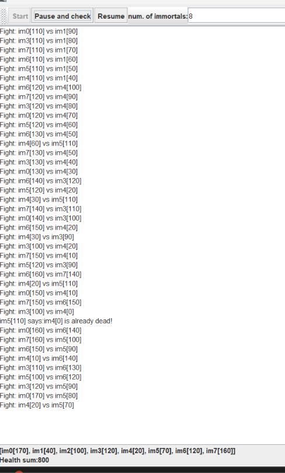

7. Tras implementar su estrategia, ponga a correr su programa, y ponga atención a si éste se llega a detener. Si es así, use los programas jps y jstack para identificar por qué el programa se detuvo.

si, se traba. con 8 inmortales a los pocos segundos la ventana se queda quieta, no pelean mas y pause and check
deja de actualizar. el proceso sigue vivo, o sea no se cayo, pero los hilos se quedaron esperando entre ellos.

con jps se saca el pid del java y con jstack se mira que estan haciendo los hilos. al final del dump sale
esto:

```
Found one Java-level deadlock:
"im5" waiting to lock ... which is held by "im6"
"im6" waiting to lock ... which is held by "im5"
```

todos estan BLOCKED en fight(), en el segundo synchronized. im5 ya tiene su lock y quiere el de im6, e im6
ya tiene el suyo y quiere el de im5. como cada uno espera al otro, nadie suelta nada y ahi se queda. eso
pasa porque a veces se pelean al mismo tiempo y cada uno toma los locks al reves.

8. Plantee una estrategia para corregir el problema antes identificado (puede revisar de nuevo las páginas 206 y 207 de _Java Concurrency in Practice_).

la idea de esas paginas es siempre tomar los dos locks en el mismo orden, para que no se crucen.

como el oponente sale al azar, se comparan los identityHashCode de this y de i2 y se bloquea primero el
mas bajo. asi da igual quien ataque, im5 vs im6 e im6 vs im5 terminan agarrando los candados igual. si los
hash salen iguales (casi nunca) se usa un tieLock antes, para que no entren los dos al mismo tiempo a esa
rama.

no se dejo un solo lock para todos porque ahi si ninguna pelea podria ir en paralelo.

despues de eso se dejo corriendo un rato con 8 y jstack ya no sale deadlock, los hilos se la pasan en el
sleep(1) y siguen peleando.

9. Una vez corregido el problema, rectifique que el programa siga funcionando de manera consistente cuando se ejecutan 100, 1000 o 10000 inmortales. Si en estos casos grandes se empieza a incumplir de nuevo el invariante, debe analizar lo realizado en el paso 4.

con 100 se volvio a romper la suma. el problema ya no era fight(), era el pause del punto 4: pauseAll()
prendia la bandera y de una sumaba, pero con tantos hilos varios todavia estaban en la pelea o en el
sleep(1) y no habian mirado la bandera. o sea se estaba leyendo la salud a medias, que con 3 casi no se
notaba.

para eso pauseAll ahora se queda esperando a que todos se duerman. hay un AtomicInteger que va contando
cuantos ya hicieron wait(), y hasta que ese numero no sea el de hilos vivos no se suma. cada inmortal se
pausa solo, igual que en el punto 4, solo que ahora el boton no sigue hasta que de verdad esten todos quietos.

con eso ya da exacto en los tres casos, la suma se queda en N x 100 aunque ya hayan muerto varios (la vida
se pasa, no se pierde). con 100 dio 10000, con 1000 dio 100000 y con 10000 dio 1000000. despues de resume
y volver a pausar sigue igual.

10. Un elemento molesto para la simulación es que en cierto punto de la misma hay pocos 'inmortales' vivos realizando peleas fallidas con 'inmortales' ya muertos. Es necesario ir suprimiendo los inmortales muertos de la simulación a medida que van muriendo. Para esto:
	* Analizando el esquema de funcionamiento de la simulación, esto podría crear una condición de carrera? Implemente la funcionalidad, ejecute la simulación y observe qué problema se presenta cuando hay muchos 'inmortales' en la misma. Escriba sus conclusiones al respecto en el archivo RESPUESTAS.txt.
	* Corrija el problema anterior __SIN hacer uso de sincronización__, pues volver secuencial el acceso a la lista compartida de inmortales haría extremadamente lenta la simulación.

si, si se pone un remove() sobre el LinkedList que ya tenian todos, se arma carrera. esa lista la usan los
hilos para escoger contra quien pelear y tambien la recorre pause and check para sumar, y LinkedList no
aguanta que uno borre mientras otro esta recorriendola.

con pocos casi no se ve, pero con muchos revienta. con 500 salio ConcurrentModificationException hasta al
dar start, porque los primeros ya estaban matando y borrando mientras el main todavia iba arrancando al
resto. a veces tambien sale IndexOutOfBoundsException (un hilo pregunta el size, otro borra, y el get ya
no calza) o la lista se daña y el programa se queda colgado. eso mismo esta en RESPUESTAS.txt.

no se le puso synchronized a la lista porque el enunciado dice que no, y ademas dejaria todas las peleas
en fila. se cambio el LinkedList por un CopyOnWriteArrayList, que es concurrente, entonces el remove del
muerto no necesita un lock nuestro y el for de pause and check ya no lanza la exception.

cuando alguien queda en 0 se saca de la lista. el hilo que se murio, en la siguiente vuelta se da cuenta
(health en 0 o ya no esta) y se sale. si entre el size y el get alguien borro, se atrapa el
IndexOutOfBounds y se vuelve a intentar. con eso dejan de pelear contra muertos y la lista se va
achicando, en la de 10000 bajaron como a 400 vivos y la suma seguia en 1000000.

11. Para finalizar, implemente la opción STOP.

el boton STOP estaba pintado pero no hacia nada. se le puso que llame a Immortal.stopAll(), que prende una
bandera stopped parecida a la de pause, suelta a los que estaban dormidos con notifyAll(), y cada hilo
en su ciclo mira esa bandera y se sale. el hilo no se mata desde afuera, se detiene solo, igual que para
pausar.

cuando se oprime, deja de pelear y la etiqueta queda en Simulation stopped. pause y resume siguen
funcionando mientras no se haya dado stop.

<!--
### Criterios de evaluación

1. Parte I.
	* Funcional: La simulación de producción/consumidor se ejecuta eficientemente (sin esperas activas).

2. Parte II. (Retomando el laboratorio 1)
	* Se modificó el ejercicio anterior para que los hilos llevaran conjuntamente (compartido) el número de ocurrencias encontradas, y se finalizaran y retornaran el valor en cuanto dicho número de ocurrencias fuera el esperado.
	* Se garantiza que no se den condiciones de carrera modificando el acceso concurrente al valor compartido (número de ocurrencias).


2. Parte III.
	* Diseño:
		- Coordinación de hilos:
			* Para pausar la pelea, se debe lograr que el hilo principal induzca a los otros a que se suspendan a sí mismos. Se debe también tener en cuenta que sólo se debe mostrar la sumatoria de los puntos de vida cuando se asegure que todos los hilos han sido suspendidos.
			* Si para lo anterior se recorre a todo el conjunto de hilos para ver su estado, se evalúa como R, por ser muy ineficiente.
			* Si para lo anterior los hilos manipulan un contador concurrentemente, pero lo hacen sin tener en cuenta que el incremento de un contador no es una operación atómica -es decir, que puede causar una condición de carrera- , se evalúa como R. En este caso se debería sincronizar el acceso, o usar tipos atómicos como AtomicInteger).

		- Consistencia ante la concurrencia
			* Para garantizar la consistencia en la pelea entre dos inmortales, se debe sincronizar el acceso a cualquier otra pelea que involucre a uno, al otro, o a los dos simultáneamente:
			* En los bloques anidados de sincronización requeridos para lo anterior, se debe garantizar que si los mismos locks son usados en dos peleas simultánemante, éstos será usados en el mismo orden para evitar deadlocks.
			* En caso de sincronizar el acceso a la pelea con un LOCK común, se evaluará como M, pues esto hace secuencial todas las peleas.
			* La lista de inmortales debe reducirse en la medida que éstos mueran, pero esta operación debe realizarse SIN sincronización, sino haciendo uso de una colección concurrente (no bloqueante).

	

	* Funcionalidad:
		* Se cumple con el invariante al usar la aplicación con 10, 100 o 1000 hilos.
		* La aplicación puede reanudar y finalizar(stop) su ejecución.
		
		-->

<a rel="license" href="http://creativecommons.org/licenses/by-nc/4.0/"></a><br />Este contenido hace parte del curso Arquitecturas de Software del programa de Ingeniería de Sistemas de la Escuela Colombiana de Ingeniería, y está licenciado como <a rel="license" href="http://creativecommons.org/licenses/by-nc/4.0/">Creative Commons Attribution-NonCommercial 4.0 International License</a>.
